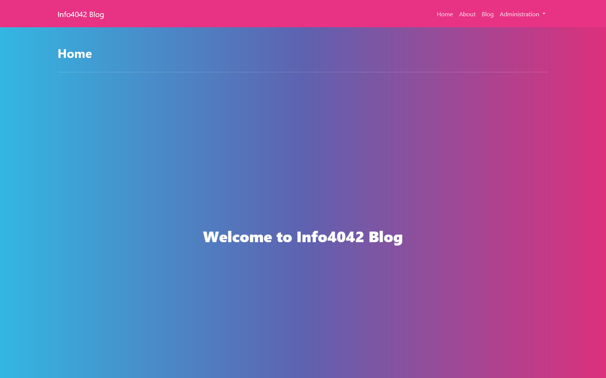
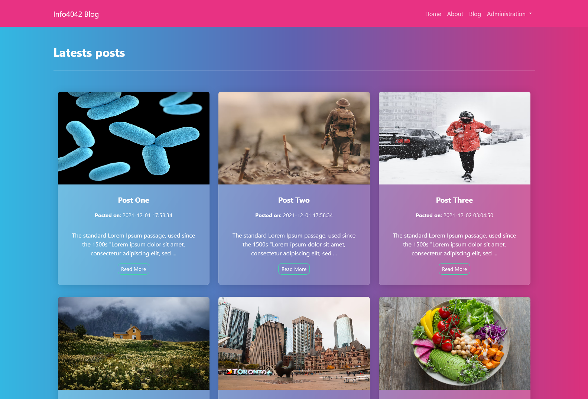

# INFO4042 BLOG 

## Welcome! 👋

## Table of contents 🙂

- [Overview](#overview)
  - [Screenshot](#screenshot)
  - [Built with](#built-with)
- [Author](#author)

<!-- ## Overview

This is a simple weather app built using goweather API. -->

### Screenshot 💻

  

  

### Built with 🧰

- PHP 
- CodeIgniter 4
- Semantic HTML5 markup
- CSS custom properties
- Javascript
- Goweather API

## Author

- Linkedin - [@Saliou](https://www.linkedin.com/in/saliou-diop-527741112/)
